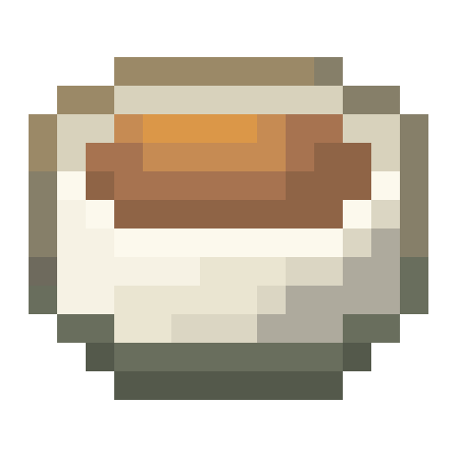
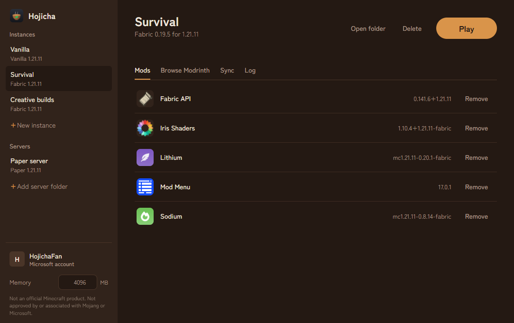
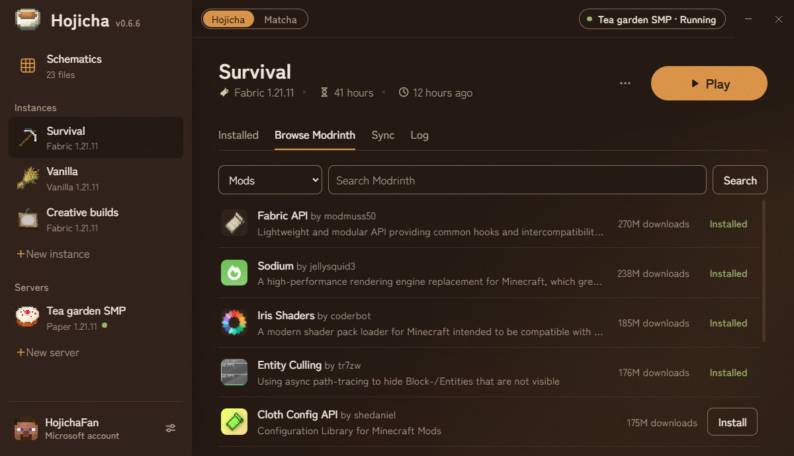
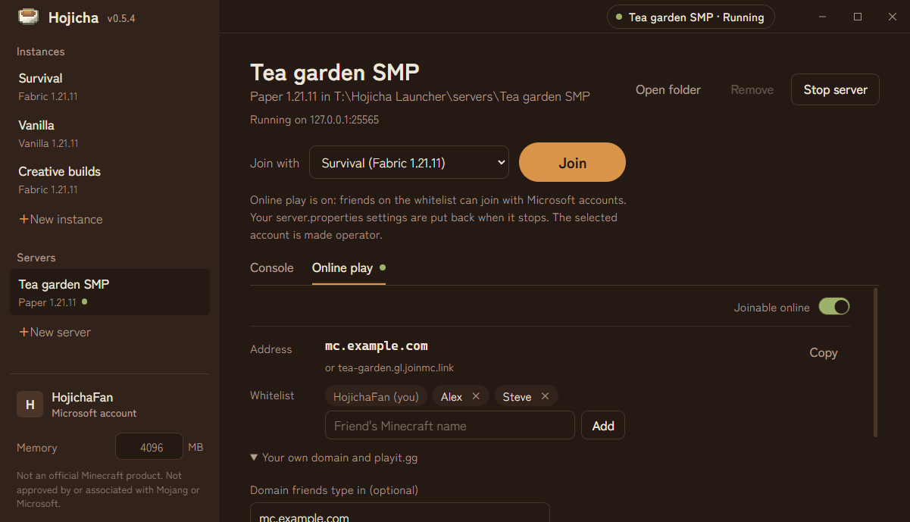
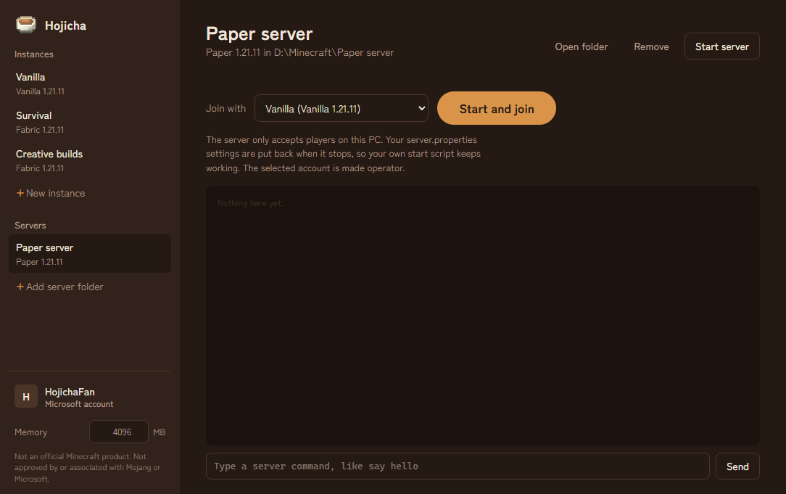

<p align="center">
  
</p>

<h1 align="center">Hojicha Launcher</h1>

<p align="center">
  A small, open-source launcher for Minecraft: Java Edition with separate instances,
  built-in Modrinth downloads, instance syncing and one-click local servers.
</p>

> **NOT AN OFFICIAL MINECRAFT PRODUCT. NOT APPROVED BY OR ASSOCIATED WITH MOJANG OR MICROSOFT.**



## Features

- **Instances**: separate game folders, vanilla or Fabric, any release or snapshot. Hojicha downloads the
  game, libraries, assets and the matching Java runtime from Mojang itself; game files are never redistributed.
- **Modrinth browser**: search mods, resource packs and shaders filtered to the instance's version and
  loader. One click installs the newest compatible version plus its required dependencies.
- **Instance syncing**: share resource packs, shader packs, screenshots, options/keybinds and the server
  list between instances.
- **Local servers**: add an existing server folder (Paper, Purpur, vanilla...) and use **Start & Join** to
  start it and jump straight in.
- **Microsoft accounts**: sign in with the official Microsoft device-code flow.

| Browse Modrinth | Local servers | Accounts |
| --- | --- | --- |
|  |  |  |

## Accounts and privacy

- **Sign-in happens on Microsoft's website.** Hojicha shows a code; you enter it at microsoft.com/link and
  sign in there. Hojicha never sees or stores your password.
- **Ownership is verified.** After signing in, Hojicha exchanges the Microsoft token through Xbox Live for a
  Minecraft session and checks that the account owns Minecraft: Java Edition.
- **Tokens stay on your PC.** They are stored in `%APPDATA%\Hojicha Launcher\data\accounts.json`, encrypted with
  Windows' user-level encryption (DPAPI via Electron `safeStorage`). Nothing is sent anywhere except Microsoft,
  Xbox Live, Mojang and Modrinth.
- **Offline accounts require a verified owner.** Offline accounts (for local and offline-mode servers) can only
  be added and used while a Microsoft account that owns the game is signed in.

## Local servers

Hojicha starts a local server with the Java version that matches it, listening on `127.0.0.1` only, so nobody
else can connect. Paper writes the launch settings into `server.properties`; Hojicha records your original
values and puts them back when the server stops (or the next time it opens, if it was closed while the server
ran), so your own start script keeps working. The selected account is made operator when the server starts.

## Install

Download the installer from the [Releases](../../releases) page, or build it yourself (below). The installer is
not code-signed yet, so Windows SmartScreen may warn on first run (**More info → Run anyway**). You choose who it's
for (just you, or everyone on the PC) and where it goes. It always creates its own `Hojicha Launcher` folder inside
the folder you pick (default `%LOCALAPPDATA%\Programs\Hojicha Launcher`), and adds desktop and Start menu
shortcuts.

To uninstall, run `uninstall.exe` in the install folder, or use **Settings → Apps**. It removes
only the launcher's own files, and keeps your instances and settings in `%APPDATA%\Hojicha Launcher\data`.

## Building from source

Requires [Node.js](https://nodejs.org/) 22 or newer.

```
npm install
npm start          # run the launcher
npm run dist       # build dist/Hojicha Launcher Setup <version>.exe
npm run icon       # regenerate build/icon.png, icon.ico and installerSidebar.bmp from the 16x16 build/logo.png
```

If `npm start` reports that Electron failed to install, your npm skipped install scripts; run
`node node_modules/electron/install.js` once. If the build fails while extracting its tools (`EXDEV` or
`7za.exe ... ENOENT`), use a short cache path: `$env:ELECTRON_BUILDER_CACHE = "$env:TEMP\eb-cache"; npm run dist`.

The installer's tweaks (own sub-folder, uninstall that only deletes the launcher's files, the sidebar picture) live in
`build/installer.nsh` and `build/after-pack.js`.

### Project layout

```
src/main.js             Electron main process, IPC, game process handling
src/preload.js          API exposed to the UI
src/renderer/           UI (HTML/CSS/JS)
src/core/auth.js        Microsoft -> Xbox Live -> Minecraft sign-in and ownership check
src/core/accounts.js    account storage, token refresh, offline-account rules
src/core/minecraft.js   version JSONs, Fabric, downloads, launch arguments
src/core/java.js        Mojang Java runtimes
src/core/modrinth.js    Modrinth search/install/dependencies
src/core/sync.js        instance syncing
src/core/servers.js     local servers
src/core/instances.js   instance storage
build/                  pixel-art logo (logo.png, 16x16) and the script that turns it into app icons
```

## Known limitations

- Windows only for now.
- No Forge, NeoForge or Quilt yet.
- Synced `options.txt` is shared as-is, so syncing it between very different versions can mix up settings.

## Contact

Hojicha Launcher is made and maintained by Quinten, who is responsible for it. For questions, bugs or
requests, please [open an issue](../../issues).

## License

[MIT](LICENSE). The bundled typeface, Zen Kaku Gothic New, is licensed under the
[SIL Open Font License 1.1](src/renderer/fonts/OFL.txt). Minecraft is a trademark of Mojang Synergies AB. Hojicha Launcher is not an official Minecraft
product and is not approved by or associated with Mojang or Microsoft.
