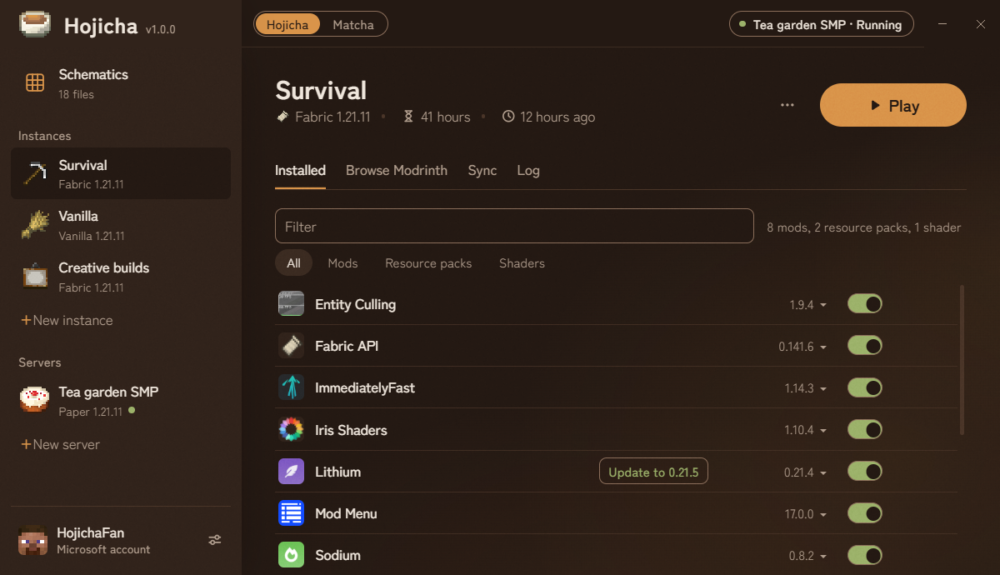
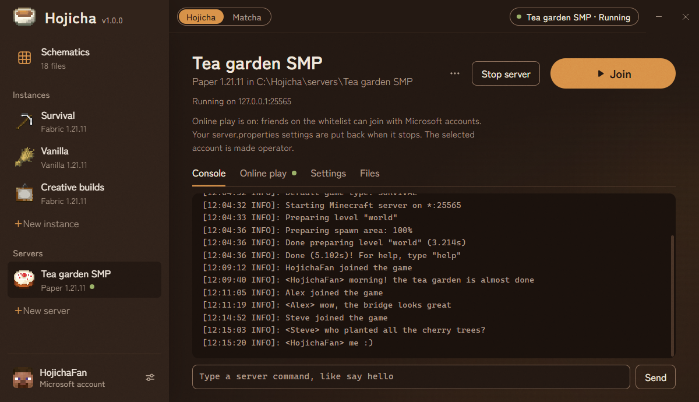
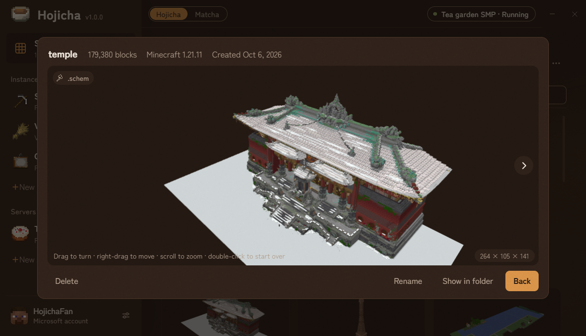
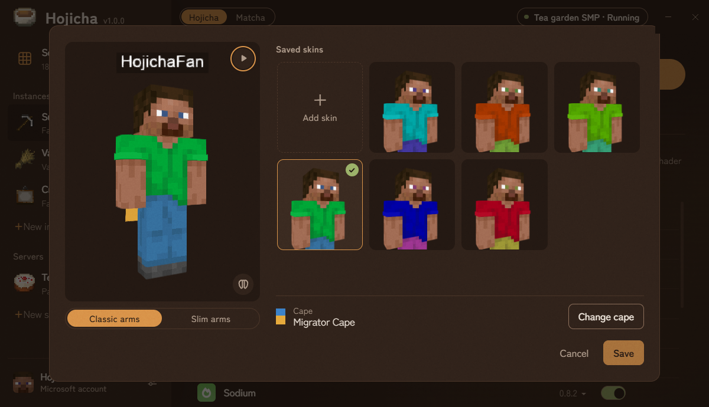
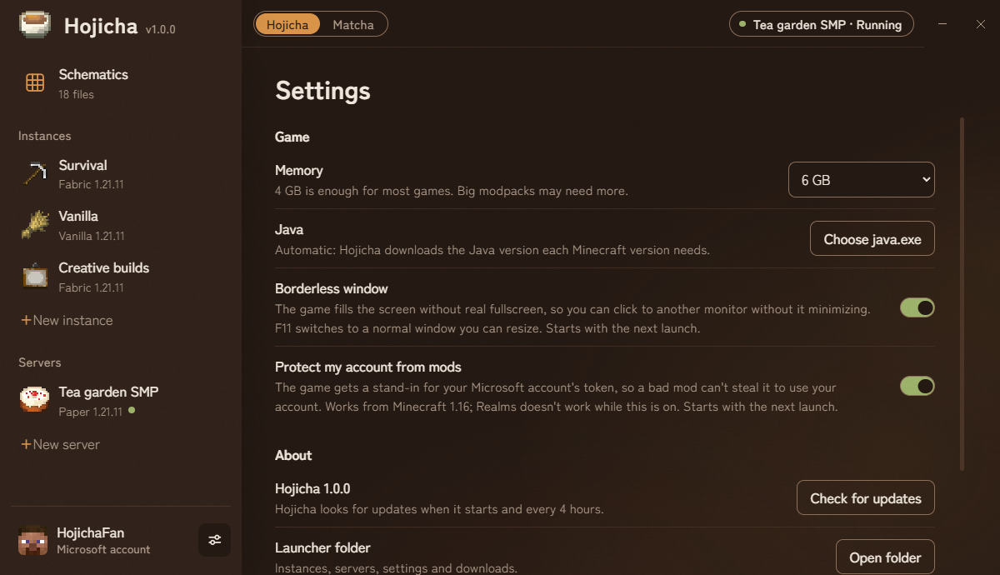
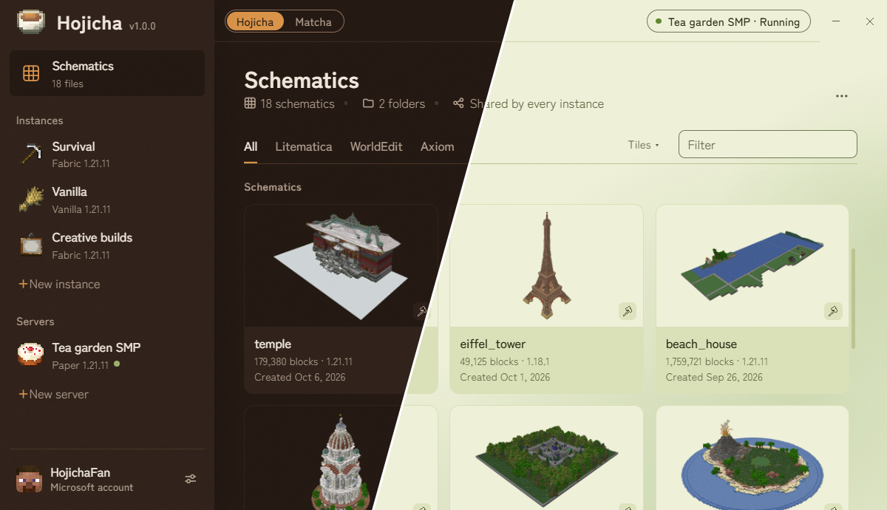

<p align="center">
  
</p>

<h1 align="center">Hojicha Launcher</h1>

<p align="center">
  A small, open-source Minecraft: Java Edition launcher for Windows (and, unofficially, macOS).
</p>

> **NOT AN OFFICIAL MINECRAFT PRODUCT. NOT APPROVED BY OR ASSOCIATED WITH MOJANG OR MICROSOFT.**

**Instances**: mods, packs and shaders in one list



**Servers**: run one, and friends join over the internet



**Schematics**: Litematica, WorldEdit and Axiom files in 3D



**Skins and capes**: change them with a 3D preview



**Settings**: memory, Java, borderless window and account protection



**Two themes**: dark Hojicha and light Matcha



## Features

### Playing

- **Instances**: vanilla or Fabric, any version, each with its own mods and worlds; drag them in the sidebar to reorder them
- **Installed**: mods, resource packs and shaders in one list; toggle or update in one click, or drop .jar files on an instance to add them (mods added by hand get their names and icons too)
- **Modrinth**: browse and install mods, packs, shaders and modpacks
- **Modpack files**: drop a Modrinth .mrpack or a Prism Launcher / MultiMC export (.zip) on the launcher to install it
- **Syncing**: share worlds, settings and packs between instances; the settings you change in-game carry over, never the ones loading resets
- **Less disk space**: a mod or pack used by several instances is stored once
- **Screenshots**: F2 screenshots are also copied to the clipboard
- **Borderless window**: the game fills the screen without real fullscreen, so you can click to another monitor without it minimising
- **Game log**: the whole log of each game, with access tokens hidden
- **Skins and capes**: change your skin and cape with a 3D preview (with an elytra and a walking animation); saved skins carry across accounts, and you can drop skin files on the window to add them
  
### Servers

- **Run a server**: Paper, Purpur or Fabric, from the same launcher
- **Online play**: friends join over the internet through [playit.gg](https://playit.gg), without port forwarding, and only if they're on the whitelist
- **Console, settings and files**: type commands, change server.properties, and edit the server's config files

### Building
- **Schematics**: view Litematica, WorldEdit and Axiom files (.litematic, .schem, .schematic, .bp) in 3D, filter them by type and organise them in folders; drop files on the launcher to add them


### Looks and safety

- **Two themes**: dark **Hojicha** and light **Matcha**
- **Sign-in on Microsoft's website**: Hojicha never sees your password; tokens are stored encrypted on your PC
- **Account protection**: from Minecraft 1.16, the game and its mods get a stand-in for your account's token, which only works through Hojicha while the game runs and can't change your name or skin, so a token copied from the game is useless (turn it off in Settings to use Realms)

## Install

Download the installer from the [Releases](../../releases) page. Windows SmartScreen may warn on first run since the installer isn't code-signed — click **More info → Run anyway**. The launcher installs to `%LOCALAPPDATA%\Programs\Hojicha Launcher` by default and updates itself automatically.

To uninstall, run `uninstall.exe` in the launcher folder or use **Settings → Apps**. This deletes the entire folder, **including your instances and worlds**, so back up anything you want to keep first.

### macOS

There's no Mac installer, but you can run the launcher from its source code:

1. Install [Node.js](https://nodejs.org) (the LTS version) and Git (run `xcode-select --install` in Terminal).
2. In Terminal, download the launcher and its parts:
   ```
   git clone https://github.com/Qu1nten/hojicha-launcher.git
   cd hojicha-launcher
   npm install
   ```
3. Start it with `npm start` (from the `hojicha-launcher` folder). To update, run `git pull` and `npm install`, then `npm start` again.

Your instances, worlds and settings are saved in the `dev-home` folder inside `hojicha-launcher`, so don't delete that folder.

Mac support is unofficial. What doesn't work on a Mac:

- **Online play** through playit.gg (hosting a server works, but only your own Mac can join it; you can still join a friend's online server)
- **Borderless fullscreen**
- **Old Minecraft versions** (before 1.13) may not start on Apple Silicon Macs
- **Automatic updates**: update with `git pull` and `npm install` instead
- Closing the launcher doesn't close a running game

## License

[MIT](LICENSE). Bundled libraries: [Zen Kaku Gothic New](src/renderer/fonts/OFL.txt) (SIL OFL 1.1), [skinview3d](src/renderer/vendor/skinview3d-LICENSE.txt) (MIT), [deepslate](src/renderer/vendor/deepslate-LICENSE.txt) (MIT). playit.gg's agent is downloaded from its official releases and is not part of this repository. Minecraft is a trademark of Mojang Synergies AB.
