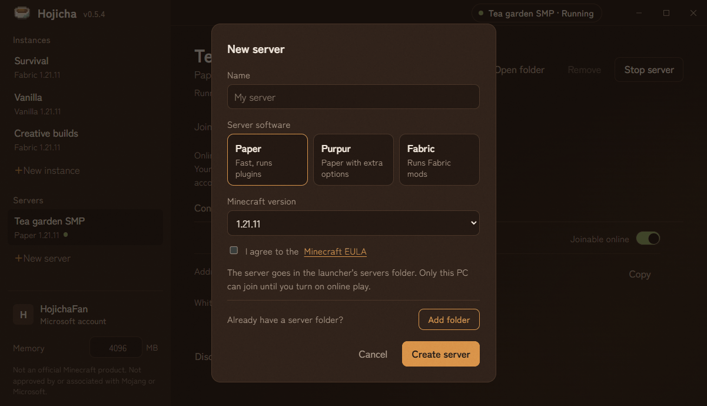
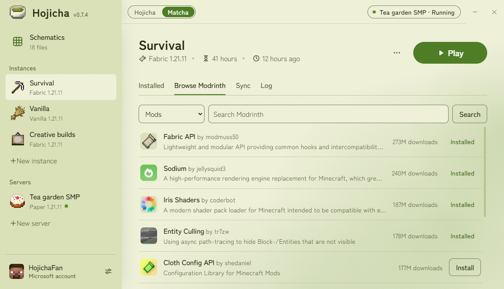

<p align="center">
  
</p>

<h1 align="center">Hojicha Launcher</h1>

<p align="center">
  A small, open-source launcher for Minecraft: Java Edition. Separate instances, Modrinth downloads,
  instance syncing, and local servers your friends can join without port forwarding.
</p>

> **NOT AN OFFICIAL MINECRAFT PRODUCT. NOT APPROVED BY OR ASSOCIATED WITH MOJANG OR MICROSOFT.**


## Features

- **Instances**: separate copies of the game, vanilla or Fabric, on any version, each with its own mods and worlds.
- **Installed**: all your mods, resource packs and shaders in one list. Switch mods on or off and update them in
  one click.
- **Modrinth**: find and install mods, resource packs, shaders and whole modpacks, with everything they need.
- **Syncing**: share worlds, settings and packs between instances.
- **Servers**: make a Paper, Purpur or Fabric server and join it in one click. Friends can join over the internet
  through [playit.gg](https://playit.gg), without port forwarding.
- **Skins and capes**: change your skin and cape from the launcher, with a 3D preview. Skins you add are kept for
  every account.
- **Schematics**: everything you save with Litematica, WorldEdit or Axiom (.litematic, .schem, .schematic, .bp), in
  one shared folder and in 3D to turn and zoom. Drop schematic files on the launcher to add them.
- **Two teas**: a dark **Hojicha** theme and a light **Matcha** theme.
- **Safe and private**: you sign in on Microsoft's own website, nothing is tracked, and updates install themselves.

| Browse Modrinth | Online play |
| --- | --- |
|  |  |
| **New server** | **Accounts** |
|  |  |



## Accounts and privacy

- **Sign-in happens on Microsoft's website.** Hojicha shows a code; you enter it at microsoft.com/link and sign in
  there. Hojicha never sees or stores your password.
- **Ownership is verified.** After signing in, Hojicha exchanges the Microsoft token through Xbox Live for a
  Minecraft session and checks that the account owns Minecraft: Java Edition.
- **Tokens stay on your PC.** They are stored in `config\accounts.json` in the launcher folder, encrypted with
  Windows' user-level encryption (DPAPI via Electron `safeStorage`).
- **Offline accounts require a verified owner.** Offline accounts can only be added and used while a Microsoft
  account that owns the game is signed in. They can join offline-mode servers on your own PC, never a server that's
  open to the internet: online play always runs the server in online mode.
- **No analytics, no telemetry.** Nothing is ever sent to the launcher's developer. Hojicha only talks to the
  services it needs, and only when it needs them:

| Service | What for |
| --- | --- |
| Microsoft, Xbox Live, Minecraft services | Signing in, checking ownership, and showing and changing your skin and cape |
| Mojang | Game versions, libraries, assets and Java runtimes, and your current skin and name at startup |
| Modrinth | Searching and downloading mods, resource packs, shaders and modpacks |
| Fabric | Fabric loader versions, and Fabric servers |
| PaperMC, PurpurMC | The server jar, only when you create a Paper or Purpur server |
| playit.gg | Only if you set up online play: linking your account, and relaying players to your server |
| GitHub | Checking for launcher updates and downloading them, and playit's agent program |
| GitHub, GitLab | Files a modpack you install says to download from there |

## Local servers

**New server** downloads the newest build of Paper, Purpur or Fabric for the Minecraft version you pick into
`servers\<name>` in the launcher folder, once you agree to the [Minecraft EULA](https://aka.ms/MinecraftEULA).
**Add folder**, in the same dialog, uses a server you already have, wherever it is.

Hojicha starts a local server with the Java version that matches it, listening on `127.0.0.1` only, so nobody else
can connect, in offline mode so your offline accounts can join. It writes those settings into `server.properties`,
records your original values and puts them back when the server stops (or the next time it opens, if it was closed
while the server ran), so your own start script keeps working. The selected account is made operator when the
server starts.

The **Settings** tab edits `server.properties` (except the values Hojicha manages), and the **Files** tab edits the
server's other config files as text. Both offer a restart after saving.

### Online play

The **Online play** tab on a server lets friends join over the internet, through [playit.gg](https://playit.gg):

1. **Set up online play** links a free playit.gg account once. You approve Hojicha Launcher in your browser, and the
   launcher keeps the key, encrypted, in `config\playit.json`. Each install links its own account; nothing is shared
   between installs.
2. Switch on **Joinable online** and start the server. Hojicha starts playit's own agent (the signed `playitd.exe`,
   pinned to one version and checked by SHA-256, kept in `meta\playit`) as an ordinary program next to the server:
   no service, no install, no admin rights. It stops with the server. The first start creates a Minecraft tunnel in
   your playit.gg account, and the tab shows the address to share.
3. Add your friends' Minecraft names to the **whitelist**. Your selected account is always on it.

While a server is public it runs in **online mode with an enforced whitelist**, so only whitelisted Microsoft
accounts get in. Players keep a separate save per mode, because Minecraft stores player data by account ID: someone
who played in offline mode starts from their online-mode save when the server is public.

## Install

Download the installer from the [Releases](../../releases) page, or build it yourself (below). The installer is not
code-signed yet, so Windows SmartScreen may warn on first run (**More info → Run anyway**). It always creates its own
`Hojicha Launcher` folder inside the folder you pick (default `%LOCALAPPDATA%\Programs\Hojicha Launcher`), and adds
desktop and Start menu shortcuts. After that, the launcher updates itself.

That folder holds the launcher and everything it stores:

```
app\         the launcher itself
instances\   one folder per instance (the game folder is instances\<name>\minecraft)
servers\     servers made with New server
synced\      worlds, mod configs, resource packs, shader packs, screenshots and options shared between instances,
             content.json with the Modrinth details of the shared packs, and schematics\ (litematic\, schematic\
             and blueprint\: what Litematica, WorldEdit and Axiom save)
meta\        Minecraft versions, libraries, assets, Java, the game's font and block models, schematic pictures and
             playit's agent, shared by all instances
skins\       skins you added or wore, shared by all accounts
config\      settings, accounts, servers and the playit.gg link
uninstall.exe, and a Hojicha Launcher shortcut
```

Nothing is stored in AppData. The folder has to be writable, so install it just for you (an install for everyone
in Program Files won't start).

To uninstall, run `uninstall.exe` in the launcher folder, or use **Settings → Apps**. After asking, it deletes the
whole launcher folder, **including your instances, servers and worlds**, so copy anything you want to keep first.
Updating only replaces `app\` and keeps everything else.

## Building from source

Requires [Node.js](https://nodejs.org/) 22 or newer.

```
npm install
npm start          # run the launcher (uses the installed launcher's folder, or dev-home\ when not installed)
npm run dist       # build dist\Hojicha-Launcher-Setup-<version>.exe
npm run icon       # regenerate build/icon.png, icon.ico and installerSidebar.bmp from the 16x16 build/logo.png,
                   # and build/icon-matcha.png (the matcha theme's title bar logo) from build/logo-matcha.png
```

If `npm start` reports that Electron failed to install, your npm skipped install scripts; run
`node node_modules/electron/install.js` once. If the build fails while extracting its tools (`EXDEV` or
`7za.exe ... ENOENT`), use a short cache path: `$env:ELECTRON_BUILDER_CACHE = "$env:TEMP\eb-cache"; npm run dist`.

### Releasing an update

Installed launchers check this repo's GitHub releases on start and every 4 hours. A newer version downloads in the
background, then the title bar shows **Restart to update** (otherwise it installs when the launcher closes). To ship
one:

1. Raise `version` in `package.json` (`npm version <x.y.z> --no-git-tag-version`), commit as `Release v<x.y.z>` with
   the changes listed in the message body, and push.
2. Set `GH_TOKEN` to a fine-grained token for this repository with **Contents: Read and write**, then run
   `npm run release`. It builds the installer and publishes one release tagged `v<version>` with the installer, its
   `.blockmap` and `latest.yml`, using the `Release v<x.y.z>` commit message as release notes
   ([build/release.js](build/release.js)). If only the upload failed, `npm run release:upload` retries it without
   building again.

Don't mark a release as a pre-release: the updater only follows the latest full release.

The installer's tweaks (own sub-folder, uninstall that only deletes the launcher's files, the sidebar picture) live in
`build/installer.nsh` and `build/after-pack.js`.

### Project layout

```
src/main.js               Electron main process, IPC, game and server process handling, updates
src/preload.js            API exposed to the UI
src/renderer/             UI (HTML/CSS/JS), fonts and icons; theme.js applies the saved theme before the first paint;
                          schematics.js reads schematics and draws them in 3D; vendor/ holds skinview3d, which draws
                          skins in 3D, deepslate, which draws blocks, and the old block numbers for .schematic files
src/core/auth.js          Microsoft -> Xbox Live -> Minecraft sign-in and ownership check
src/core/accounts.js      account storage, token refresh, offline-account rules
src/core/minecraft.js     version JSONs, Fabric, downloads, launch arguments
src/core/java.js          Mojang Java runtimes
src/core/modrinth.js      Modrinth search/install/dependencies/versions
src/core/modpacks.js      installing Modrinth modpacks (.mrpack) as new instances
src/core/sync.js          instance syncing, schematics included
src/core/instances.js     instance storage, play time
src/core/icons.js         item icons for instances and servers, and the font for name tags, from a downloaded client jar
src/core/skins.js         saved skins: adding them, recognising the same skin twice, removing them
src/core/schematics.js    the Schematics view's files: listing, reading, their saved pictures
src/core/blocks.js        block models and textures for the schematics view, from a downloaded client jar
src/core/servers.js       local servers: creating, starting, server.properties, whitelist
src/core/serverConfig.js  the Settings and Files tabs: server.properties and config files
src/core/serverTypes.js   Paper, Purpur and Fabric server downloads
src/core/playit.js        online play: playit.gg linking, agent and tunnel
src/core/storage.js       picks the launcher folder everything is stored in
build/                    pixel-art logos (logo.png and logo-matcha.png, 16x16), icons and installer scripts
build/release.js          publishes a built installer as a GitHub release (npm run release)
```

## Known limitations

- Windows only for now.
- No Forge, NeoForge or Quilt yet.
- Synced `options.txt` is shared as-is, so syncing it between very different versions can mix up settings.
- Synced worlds are upgraded when opened in a newer version and may not open in older ones afterwards.
- The schematics view draws vanilla blocks with the newest downloaded game version: blocks from mods show as
  missing-texture cubes. Schematics of more than a million blocks aren't drawn.
- Online play uses playit.gg's own address for each server; your own domain isn't supported.

## Contact

Hojicha Launcher is made and maintained by Quinten, who is responsible for it. For questions, bugs or requests,
please [open an issue](../../issues).

## License

[MIT](LICENSE). The bundled typeface, Zen Kaku Gothic New, is licensed under the
[SIL Open Font License 1.1](src/renderer/fonts/OFL.txt). The bundled skin viewer, skinview3d (with three.js), is
licensed under the [MIT License](src/renderer/vendor/skinview3d-LICENSE.txt), and so is the bundled block renderer,
deepslate ([license](src/renderer/vendor/deepslate-LICENSE.txt)), and the table of old block numbers from
[minecraft-data](https://github.com/PrismarineJS/minecraft-data) (MIT). playit.gg's agent is downloaded from its official
GitHub releases and isn't part of this repository. Minecraft is a trademark of Mojang Synergies AB. Hojicha Launcher is not
an official Minecraft product and is not approved by or associated with Mojang or Microsoft.
